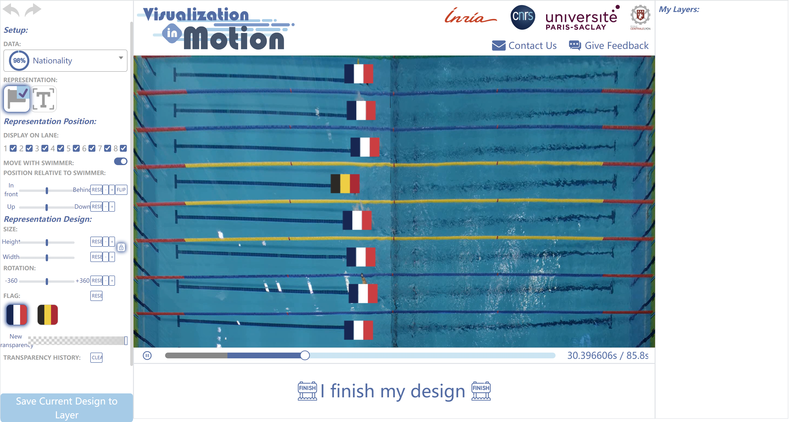

# Visualization in motion - *SwimFlow*

This is a repository for original codes of a technology probe, *SwimFlow*, provided  in the paper ["Designing for Visualization in Motion: Embedding Visualizations in Swimming Videos"](https://doi.org/10.1109/TVCG.2023.3341990), published at [IEEE Transactions of Visualization and Computer Graphics](https://www.computer.org/csdl/journal/tg) and presented at [IEEE Visualization 2024](https://ieeevis.org/year/2024/welcome).
*SwimFlow* allows users to embed visualizations into a swimming video and enable visualizations moving along with the real tracking data of swimmers, an online interactive version can be accessed at https://motion.isenberg.cc/Swimming/index.

If you use *SwimFlow* and our results on **Visualization in motion** in new projects or use it in a different way, we would appreciate a citation:

*SwimFlow* is released under [CC-BY 4.0 license](https://creativecommons.org/licenses/by/4.0/), to cite *SwimFlow* as a single tool: 

* [*SwimFlow*](https://motion.isenberg.cc/Swimming/index), created by AVIZ, Inria in 2023.

    ```
    @misc{SwimFlow,
        author = {AVIZ, Inria},
        title = {SwimFlow: An interactive technology probe},
        url = {https://motion.isenberg.cc/Swimming/index},
        year = {Created 2023}
    }
    ```

To cite the entire paper:

* Lijie Yao, Romain Vuillemot, Anastasia Bezerianos, Petra Isenberg. Designing for Visualization in Motion: Embedding Visualizations in Swimming Videos. IEEE Transactions on Visualization and Computer Graphics, vol. 30, no. 3, pp. 1821-1836, March 2024. doi: [10.1109/TVCG.2022.3184993](https://doi.org/10.1109/10.1109/TVCG.2023.3341990).

    ```
    @ARTICLE{YAO:2024:Swimming,
        author = {Yao, Lijie and Vuillemot, Romain and Bezerianos, Anastasia and Isenberg, Petra},
        journal = {IEEE Transactions on Visualization and Computer Graphics}, 
        title = {Designing for Visualization in Motion: Embedding Visualizations in Swimming Videos}, 
        year = {2024},
        volume = {30},
        number = {3},
        pages = {1821--1836},
        doi = {10.1109/TVCG.2023.3341990}
    }
    ```

To cite the umbrella paper of the topic **Visualization in motion**:

* Lijie Yao, Romain Vuillemot, Anastasia Bezerianos, Petra Isenberg. Visualization in motion: A Research Agenda and Two Evaluations. IEEE Transactions on Visualization and Computer Graphics, vol. 28, no. 10, pp. 3546-3562, 1 Oct. 2022, doi: [10.1109/TVCG.2022.3184993](https://doi.org/10.1109/TVCG.2022.3184993).

    ```
    @ARTICLE{YAO:2022:VisInMotion,
        author={Yao, Lijie and Bezerianos, Anastasia and Vuillemot, Romain and Isenberg, Petra},
        journal={IEEE Transactions on Visualization and Computer Graphics}, 
        title={Visualization in Motion: A Research Agenda and Two Evaluations}, 
        year={2022},
        volume={28},
        number={10},
        pages={3546--3562},
        doi={10.1109/TVCG.2022.3184993}
    }
    ```

To cite the relevant paper presented at [IEEE Visualization 2024](https://ieeevis.org/year/2024/welcome) on visualization in motion with a focus on **Video Games**:

* Lijie Yao, Federica Bucchieri, Victoria McArthur, Anastasia Bezerianos, Petra Isenberg. User Experience of Visualizations in Motion: A Case Study and Design Considerations. IEEE Transactions on Visualization and Computer Graphics, vol. 31, no. 1, pp. 174-184, 1 Jan. 2025, doi: [1109/TVCG.2024.34563193](https://doi.org/1109/TVCG.2024.3456319).

    ```
    @ARTICLE{YAO:2025:VideoGame,
        author={Yao, Lijie and Bucchieri, Federica and McArthur, Victoria and Bezerianos, Anastasia and Isenberg, Petra},
        journal={IEEE Transactions on Visualization and Computer Graphics}, 
        title={User Experience of Visualizations in Motion: A Case Study and Design Considerations}, 
        year={2025},
        volume={31},
        number={1},
        pages={174--184},
        doi={10.1109/TVCG.2024.3456319}
    }
    ```

To read more on **Visualization in Motion**:

1. **The positioning paper**: Lijie Yao, Anastasia Bezerianos, Romain Vuillemot and Petra Isenberg, "Visualization in Motion: A Research Agenda and Two Evaluations," in IEEE Transactions on Visualization and Computer Graphics, vol. 28, no. 10, pp. 3546-3562, 1 Oct. 2022, doi: [10.1109/TVCG.2022.3184993](https://doi.org/10.1109/TVCG.2022.3184993/). Link: [Author version](https://lijieyao.com/assets/pdf/Vis_in_motion_A_Research_Agenda_and_Two_Evaluations.pdf )

2. **With a focus on swimming**: Lijie Yao, Romain Vuillemot, Anastasia Bezerianos and Petra Isenberg, "Designing for Visualization in Motion: Embedding Visualizations in Swimming Videos," in IEEE Transactions on Visualization and Computer Graphics, vol. 30, no. 3, pp. 1821-1836, March 2024, doi: [10.1109/TVCG.2023.3341990](https://doi.org/10.1109/TVCG.2023.3341990). Link: [Author version](https://lijieyao.com/assets/pdf/Situated_Visualization_in_Motion.pdf).

3. **With a focus on video games**: Lijie Yao, Federica Bucchieri, Victoria McArthur, Anastasia Bezerianos and Petra Isenberg, "User Experience of Visualizations in Motion: A Case Study and Design Considerations," in IEEE Transactions on Visualization and Computer Graphics, vol. 31, no. 1, pp. 174-184, Jan. 2025, doi: [10.1109/TVCG.2024.3456319](https://doi.org/10.1109/TVCG.2024.3456319). Link: [Author version](https://lijieyao.com/assets/pdf/User_Experience_of_Visualizations_in_Motion_A_Case_Study_and_Design_Considerations.pdf).

4. **A short summarization**: Lijie Yao. Situated Visualization in Motion. IEEE Computer Graphics and Applications. In press. doi: [10.1109/MCG.2024.3462129](https://doi.org/10.1109/MCG.2024.3462129). Link: [Author version](https://lijieyao.com/assets/pdf/Situated_Visualization_in_Motion.pdf). 

5. **Awarded dissertation**: Lijie Yao. Situated Visualization in Motion. Human-Computer Interaction [cs.HC]. Université Paris-Saclay, 2023. English. NNT: 2023UPASG093. URL: [Author version](https://theses.hal.science/tel-04413122).

## Getting started

To get started, either clone this repository or if you stay within Github, use the ''use this template'' function to generate your own version of this repository from which you can then edit. You will see the project hierarchy as follows:

```
└── Main directory
    ├── SwimFlow
    └── README.md
```

Then, you need to download from [here](https://drive.google.com/file/d/1Wj2BNrbZehLB6RI_cpLnUtpAkrFS9y0z/view?usp=sharing), our swimming video, which is a **mandatory** component to let *SwimFlow* work properly. 
Please put the downloaded video under the folder /SwimFlow/video and **name it as follows**:

```
└── Main directory
    ├── SwimFlow
        ├── ...
        ├── video
            ├── 2021_Montpellier_100_brasse_birdseyes.mp4
        └── ...
    └── README.md
```

Next, test your codes extensively. 

* Locally, you can use a development environment such as MAMP to serve the *SwimFlow* pages and to test whether the tool works as it should. If you use MAMP, set the server directory in the preferences to the base directory of *SwimFlow*, that is, the level at which you can find this read.me file. Then start the server and open the page:
    ```
    http://localhost:8080/SwimFlow/index
    ```
    in your browser (Please check if YOUR GATE NUMBER is 8080 or not. If not, replace 8080 by **YOUR GATE NUMBER**).

* If you prefer to use a php server, please first start a php server with the main directory of the repo as the root directory (so that index.html is at the base level), and CD to the director where you can find this readme file. Then enter
    ```
    php -S localhost:8080
    ```
    in the terminal. Same as before, change "8080" with **YOUR GATE NUMBER**. Now please enter the link mentioned above in your browser.

Now, you should be able to access and use *SwimFlow* to embed and design our own visualizations into the provided swimming video. Please note if the video was correctly downloaded, named, and put into the right place, a playing video should be able to be viewed. An example user interface image is below:



## Go further
Here, we specifically explain some key features to help you contribute according to your purpose based on our *SwimFlow*. 

```
└── Main directory
    ├── SwimFlow
        ├── ajax
        ├── css
        ├── csv <= swimmers' tracking data in CSV format, replace it with your tracking data corresponding to your own video 
        ├── design  <= users' design parameters recorded in JSON format, can be used to replicate their design process and final designs
        ├── img
        ├── js <= main functionalities of SwimFlow
        ├── php
        ├── results <= users' log files, feedback, and comments 
        ├── video <= our swimming video, recorded under authorization, can be replaced by your video
        ├── vis
        ├── webfont
        ├── index.html <= main page
        ├── sharing.html <= the page called when sharing and advertising the final designs on social media
        └── ...
    └── README.md
```

## Updating in progress
*SwimFlow* is currently under improvement. 
Please find the latest version at https://aviz.gitlabpages.inria.fr/vis-in-motion-swimflow/.
Please note that such link might not work properly before the latest version is ready for release.


